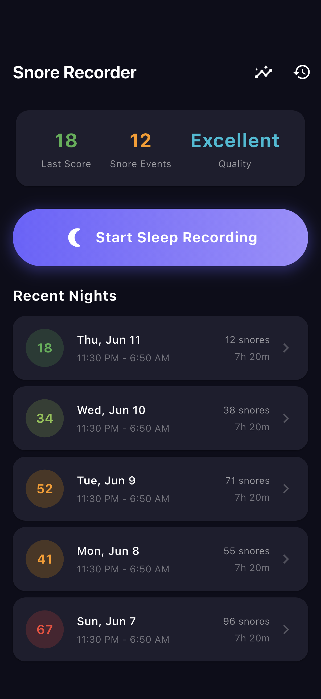
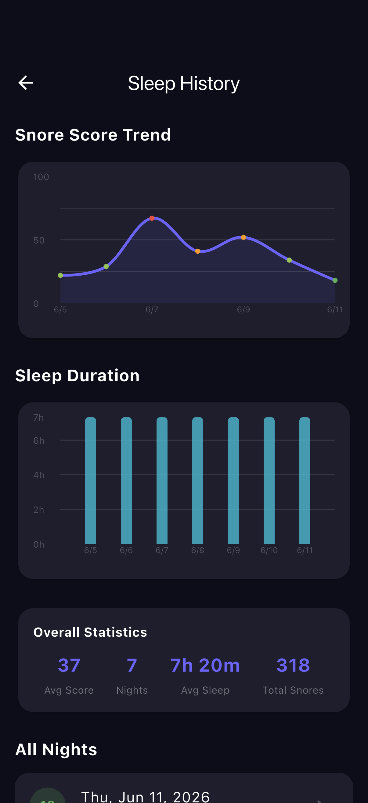
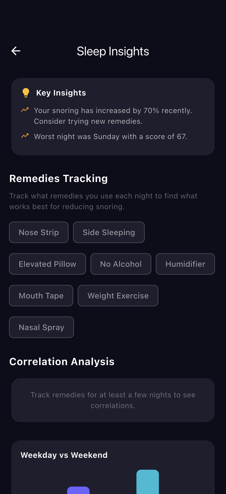
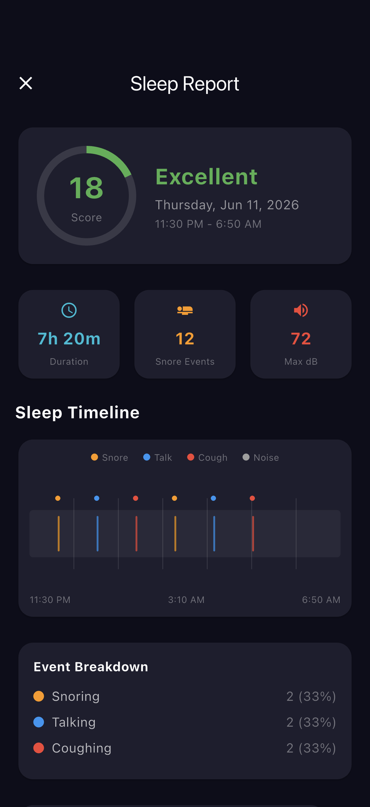

# Flutter Snore Recorder

A Flutter POC for snore recording and sleep analysis with FFT-based audio detection, built with Riverpod state management.

## Demo

These are real iOS-Simulator captures from the running app (see [FLOW.md](FLOW.md) for how they were generated).

| Home | History | Insights | Night Report |
| --- | --- | --- | --- |
|  |  |  |  |


## Features

- **Audio Recording** - Background audio recording during sleep using platform channels with configurable sensitivity
- **FFT Snore Detection** - Real-time frequency analysis (30-500Hz band) to classify audio events as snoring, talking, coughing, or ambient noise
- **Sleep Detection** - Automatic sleep onset/wakeup detection using accelerometer data and audio patterns
- **Snore Score** - Composite score (0-100) based on snore duration percentage, loudness, and frequency
- **Real-time Waveform** - Live audio waveform visualization with CustomPainter
- **Sleep Timeline** - Color-coded timeline showing all audio events throughout the night
- **Sleep History** - Charts showing snore score trends, sleep duration, and weekday vs weekend comparison
- **Remedies Tracking** - Track what remedies you use (nose strips, side sleeping, etc.) and see correlation with snore scores
- **Insights** - Automatic analysis of sleep patterns, trends, and remedy effectiveness

## Architecture

```
lib/
  main.dart                      # App entry, routing, theme
  models/
    sleep_session.dart           # Sleep session data model
    audio_event.dart             # Audio event classification model
  services/
    audio_recorder.dart          # Background recording with platform channels
    audio_analyzer.dart          # FFT analysis, snore detection, scoring
    sleep_detector.dart          # Sleep onset/wakeup via accelerometer + audio
  providers/
    sleep_provider.dart          # Riverpod providers, recording controller
  screens/
    home_screen.dart             # Dashboard, start recording, recent nights
    recording_screen.dart        # Live recording with waveform and events
    results_screen.dart          # Night report with score, timeline, playback
    history_screen.dart          # Charts and trends over time
    insights_screen.dart         # Remedies tracking and correlation analysis
  widgets/
    waveform_painter.dart        # CustomPainter for real-time waveform
    sleep_timeline.dart          # Timeline widget with tagged audio events
```

## Tech Stack

- **Flutter 3.16+** with Material 3
- **Riverpod** for state management
- **go_router** for navigation
- **record** for audio recording
- **just_audio** for playback
- **fft** for frequency analysis
- **fl_chart** for charts
- **hive** for local persistence
- **sensors_plus** for accelerometer

## Audio Analysis Pipeline

1. Microphone captures audio at 44.1kHz
2. Hann window applied to 2048-sample chunks
3. FFT computes frequency spectrum
4. Energy computed in frequency bands:
   - Snoring: 30-500Hz
   - Speech: 300-3400Hz
   - Coughing: 200-2000Hz
5. Classification based on energy ratios and dominant frequency
6. Rhythmic pattern detection via autocorrelation

## Getting Started

```bash
flutter pub get
flutter run
```

Requires microphone and motion sensor permissions.
